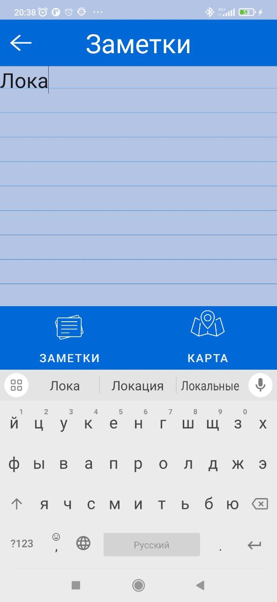

## Инструкция
1. откройте терминал
2. перейдите в папку проекта
3. запустите команду
`gradlew assembleDebug `
4. Исполняемый файл появится в Mob\app\build\outputs\apk\debug

### Руководство пользователя

| Рисунок 1 | Рисунок 2 | Рисунок 3 |
| ------------- | ------------- | ------------- |
|  |  |  |

При запуске приложения вы видите список заметок (рисунок 1). При нажатии на плюс внизу справа на рисунке 1 вы перейдете экран редактирования/создания заметки (рисуонк 2). На экране редактирования/создания заметки можно вводить текст, как показано на рисунке 3.

| Рисунок 4 | Рисунок 5 | Рисунок 6 |
| ------------- | ------------- | ------------- |
|  |  |  |

Нажав на круглую кнопку с двумя стрелочками около слова Геопозиция на рисунке 2 вы перейдете, вы перейдете на рисунок 4. Здесь вы можете полистать карту и выбрать место для метки, как демонстирует рисунок 5. На этой карте может существовать только одна метка. Нажав на галочку в верхнем правом углу вы подтвердите метку и вернетесь на экран создания/редактирования заметки (рисунок 6). 

| Рисунок 7 | Рисунок 8 | Рисунок 9 |
| ------------- | ------------- | ------------- |
|  |  |  | 

Чтоб показать погоду в выбраной локации вам придется сохранить заметку, для этого вы должны нажать кнопку в верхнем левом углу рисунка 6. Сделав это вы вернетесь на рисунок 7. Заметьте, что рисунок 1 отличается от рисунка 7, те что появилась только что созданная заметка. Что бы произошло, если вы не сохранили заметку или не ввели локацию и попытались получить погоду? Это продемонстировано на рисунке 8. Вы получите сообщениевнизу страницы, больше ничего не произойдет. Если бы вы выбрали нашу созданную заметку на рисунке 7, а затем нажали на круглую кнопку с двумя стрелочками около слова Погода, то вы бы получили градусы по Цельсию и описание облаков.

| Рисунок 10 | Рисунок 11 | Рисунок 12 |
| ------------- | ------------- | ------------- |
|  |  |  |

Если вы нажмете на стрелочку назад в верхнем левом углу рисунка 9, то вернетесь на рисунок 7. Нажав на иконку мусорки около любой заметки (например заметки локация 2), она будет удалена. Все это время мы находились на экране Заметок, давайте передем на экран Карты, нажав соответсвующую кнопку внизу справа. Вы увидите карту с точками. К примеру, точка на рисунке 11. При нажетии на нее вы можете увидеть текст заметки, как показано на рисунке 12.
